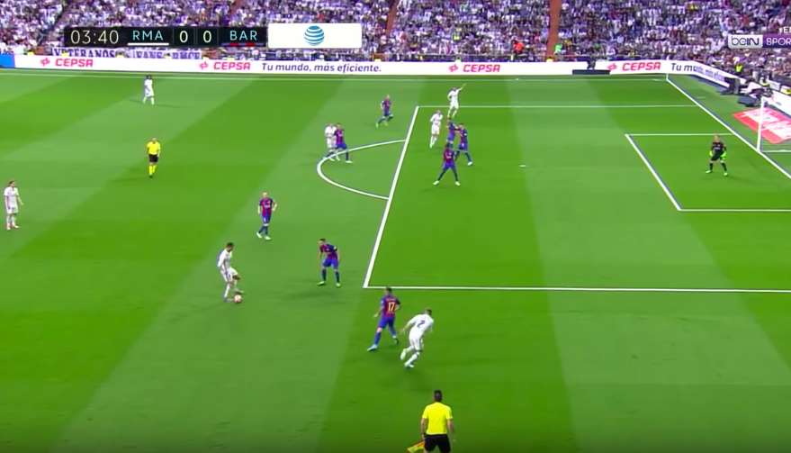

## Introduction:

- This Software detects the Score and Time written on the top left corner in the football match.
- For now Software supports only one particular format of the game.
- I am using a combination of LSTM and CNN networks to detect the information.
- Detction accuracy is more than 95%. 

### Input Image:

### Output detection

##### Software language: Python 3.6
--------------------------------------------------------------------------------------------
`data/` It stores the image to detect, uploaded on the site.

`model/` Contain the pretrained model (LSTM + CNN).

`sliding_window/`  Sliding window approach implementation.

`templates/` HTML page for the web page.

`app.py` Python flask app. Uses the code from final_project.py

`final_project.py` Main approach implementation.

`jupyter.ipynb` Same implementation of final_project.py in ipython notebook.

`requirements.txt` Required python packages.

`test.ipynb` Script to generate frames from a video.

--------------------------------------------------------------------------------------------

AWS link to the project:        http://18.222.93.36:8080/

Images Dataset for testing:     https://drive.google.com/open?id=1lpH-8w5751zdTxRo4271-eTUlys8viSr

Git-Hub link to the project:    https://github.com/shivaverma/Score-Time-Detection

Football match format:          https://www.youtube.com/watch?v=1rWw2LkYzAQ&t=3403s

Reference Paper:                https://arxiv.org/pdf/1507.05717.pdf
